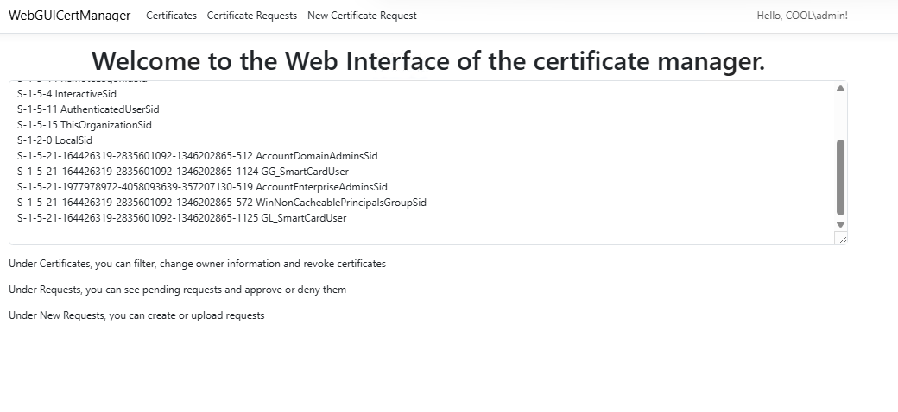
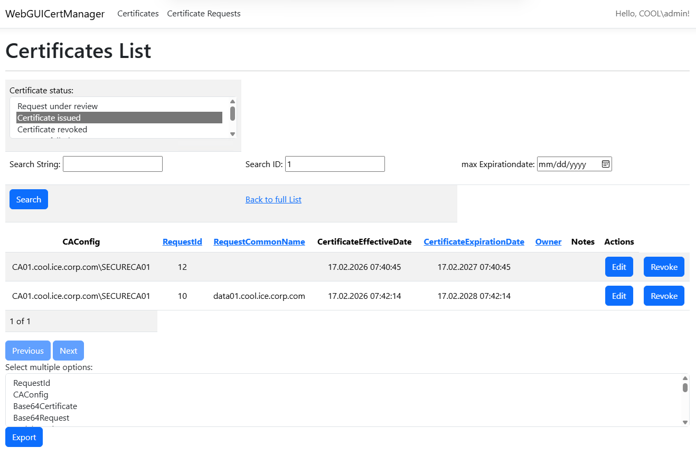
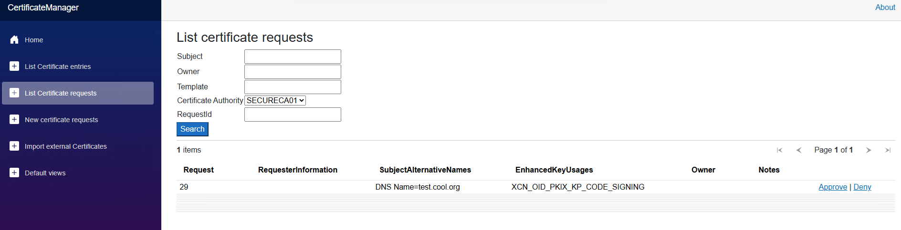
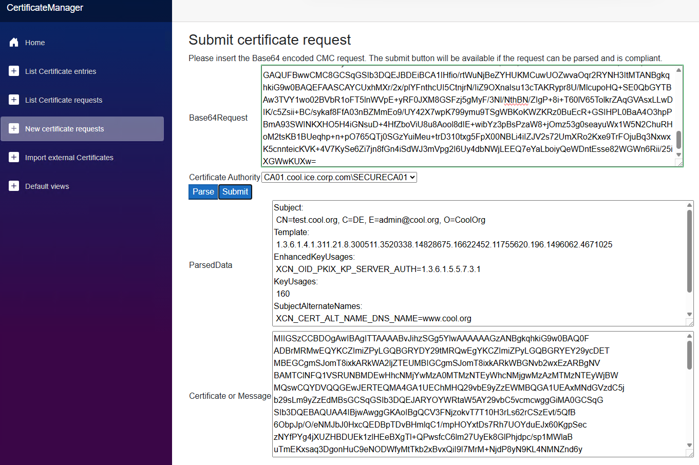
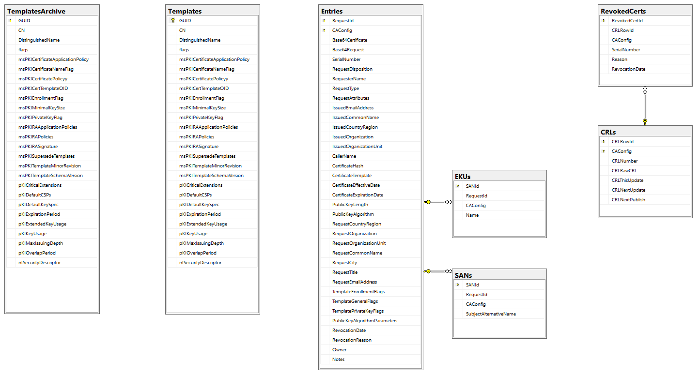

## Welcome to the Certificate Management project

The architecture can be outlined as follows

The UI has different pages

The main page shows some guidance of what the user can do (role based access still on todo)

Here for filtering, exporting, editing owner information or revocation

Here for approval or to deny new requests

For submitting new requests

The backend consists of an exit module where changes on the certificate authority
are written to a SQL database

The used database has the following tables

