## Certificate Management // Welcome to the Grid

Certificates keep the network civilized—or at least make it look that way. Behind the polished terminals, though, certificate services can become a maze of manual requests, broad firewall rules, aging credentials, and audit logs nobody wants to read at 03:00.

This project brings the whole operation onto one console. Its mission is to make certificate management less painful and a little more predictable:

- automate certificate requests and issuance through an HTTP API, keeping firewall exposure under control
- make approval and denial workflows straightforward, so certificate templates can stay locked down
- automatically approve custom requests when they satisfy company policy or when ownership of the target server or domain has been verified
- revoke certificates without embarking on a scavenger hunt
- report on expiring certificates, open requests, and failed requests before they turn into an incident
- log and export the important data needed for point-in-time recovery when disaster strikes

## The Crew

The solution is split into a few specialized components. Each handles its own stretch of the sprawl:

- **Exit Module** — watches the certificate authority and automatically writes its data to a SQL database
- **Web Interface** — a Blazor application providing user and administrator access to the main certificate-management workflows
- **Admin Client** — a WinUI desktop application for administration, initial setup, imports, and advanced operations such as reliable script signing and signature tracking; this helps reduce trouble caused by expired or revoked code-signing certificates
- **Web API** — handles automated certificate requests over HTTPS and validates ownership of servers or domains; this component is currently under development
- **Certificate Request Client** — a desktop application for submitting and testing certificate requests through the API

## Network Map

Here is the architecture at a glance—the routes, the nodes, and the places where the data changes hands:

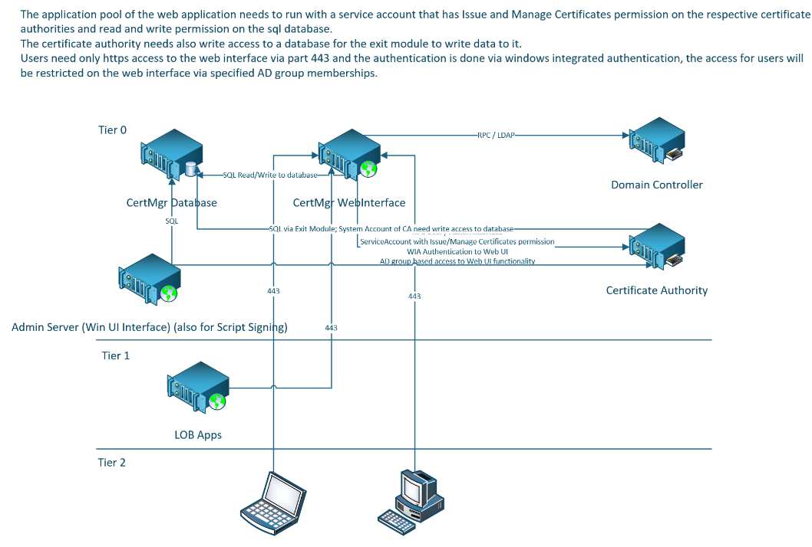

## Web Interface // Street-Level View

The web interface divides the daily work into focused pages.

### Main Console

The landing page offers guidance based on what the operator can do. Role-based access is still on the job board.

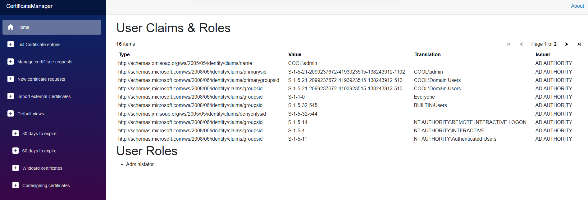

### Certificate Inventory

Filter the certificate inventory, export records, update owner information, or revoke a certificate that should no longer be trusted.

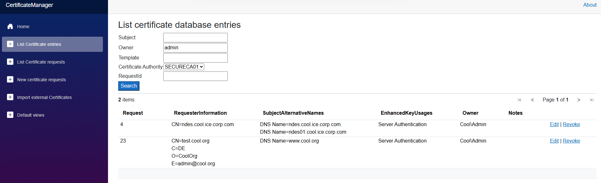

### Request Review

Inspect incoming certificate requests, then approve the clean ones or deny anything that does not pass inspection.

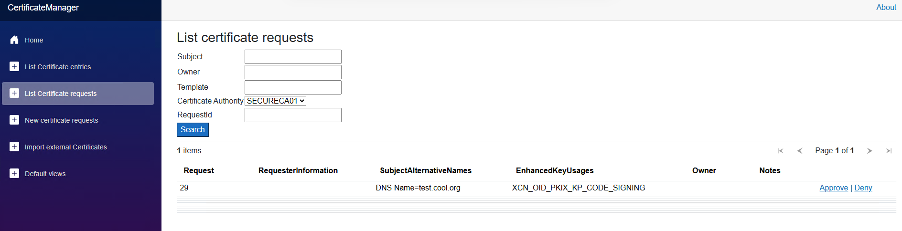

### New Requests

Submit a fresh certificate request without having to negotiate the old maze by hand.

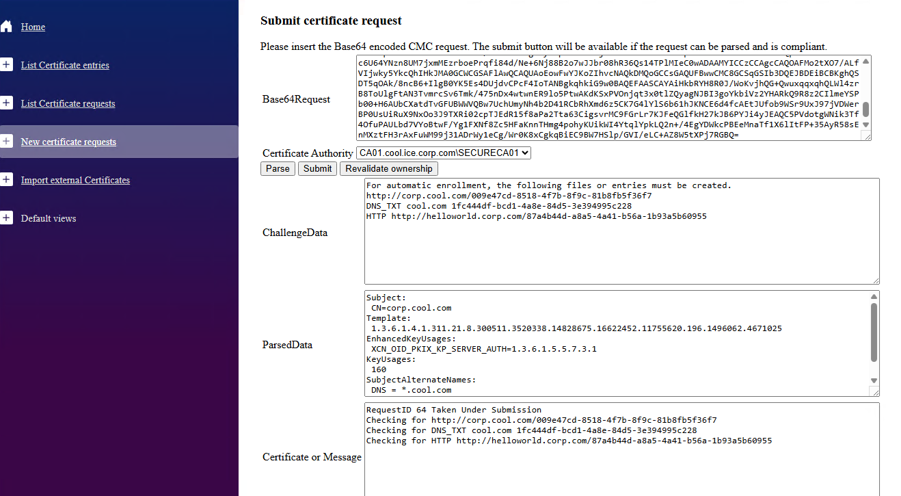

## Backend // Below the Neon

The backend includes an exit module running close to the certificate authority. When the authority changes, the module captures the new state and writes it to the SQL database. Quiet, automatic, and exactly where it needs to be.

## Admin Client // The Operator's Rig

The dedicated admin interface provides the heavier tools: setup, imports, certificate operations, script signing, and statistics.

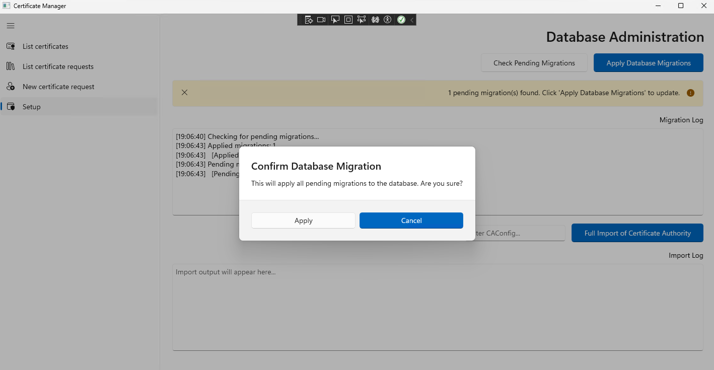

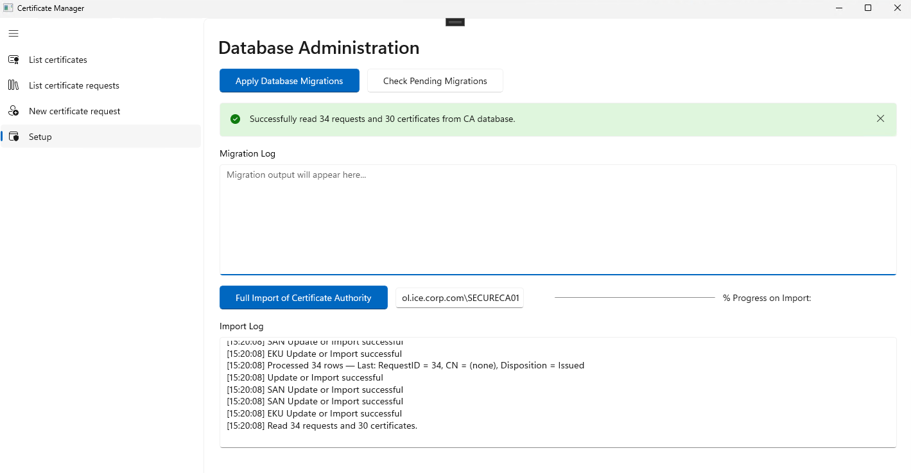

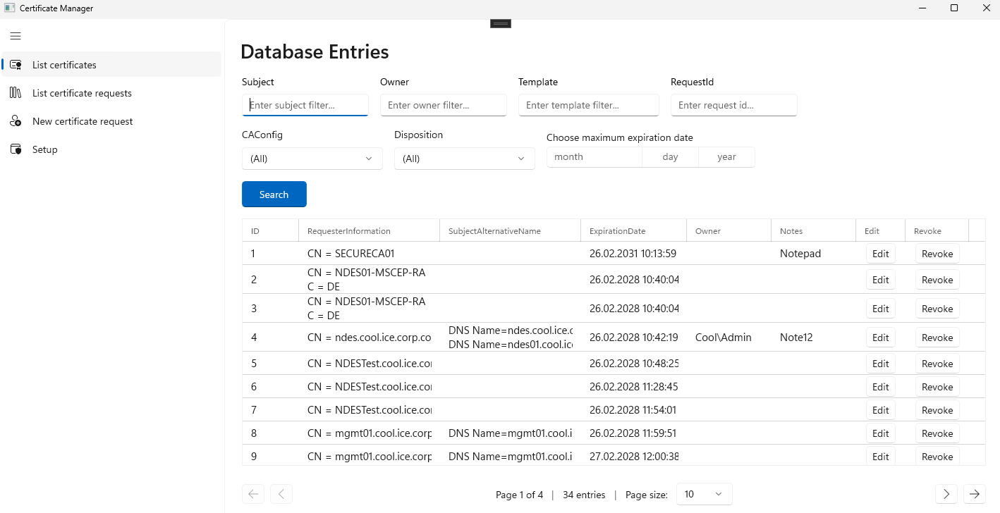

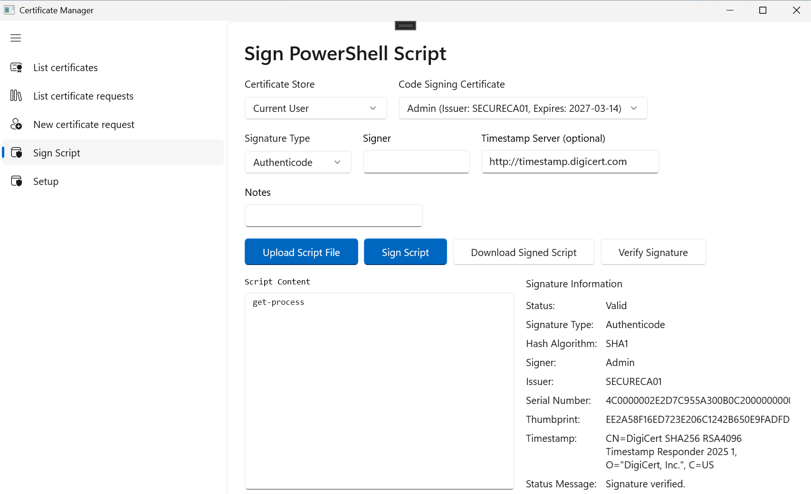

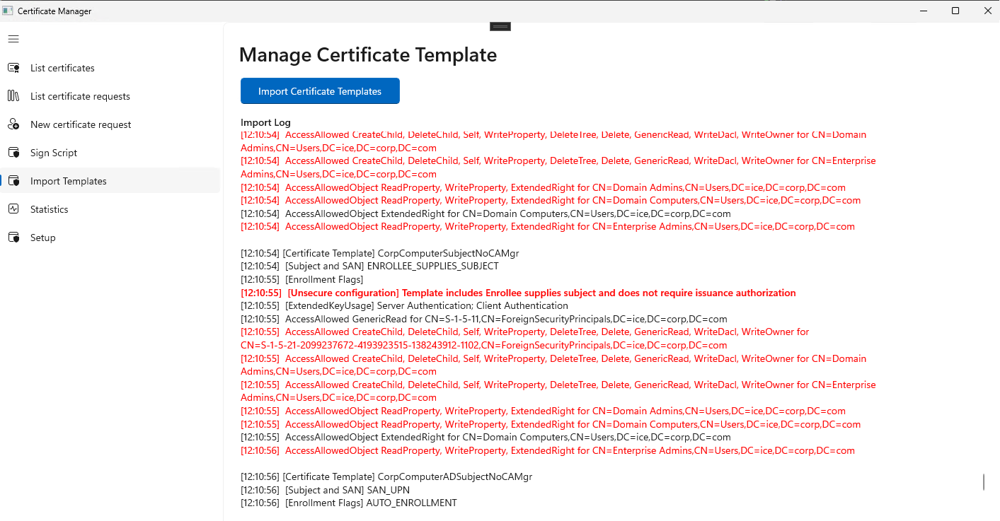

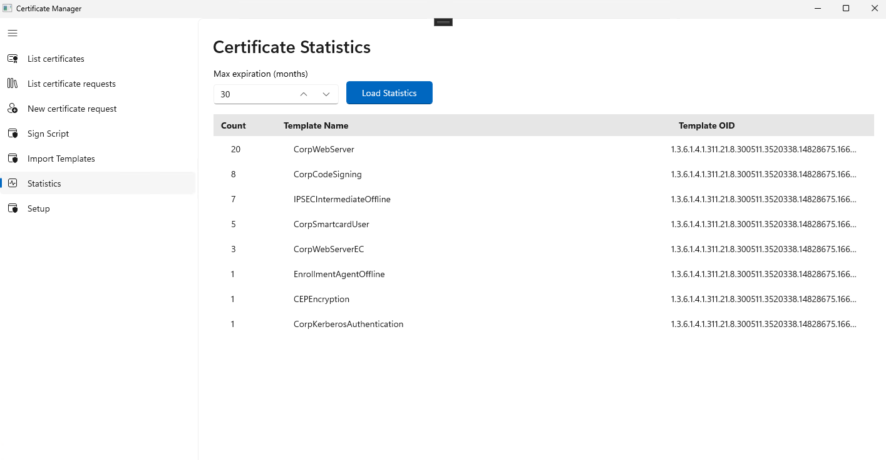

## Data Vault

Everything the system learns eventually reaches the database. These are the tables keeping the operation's memory intact:

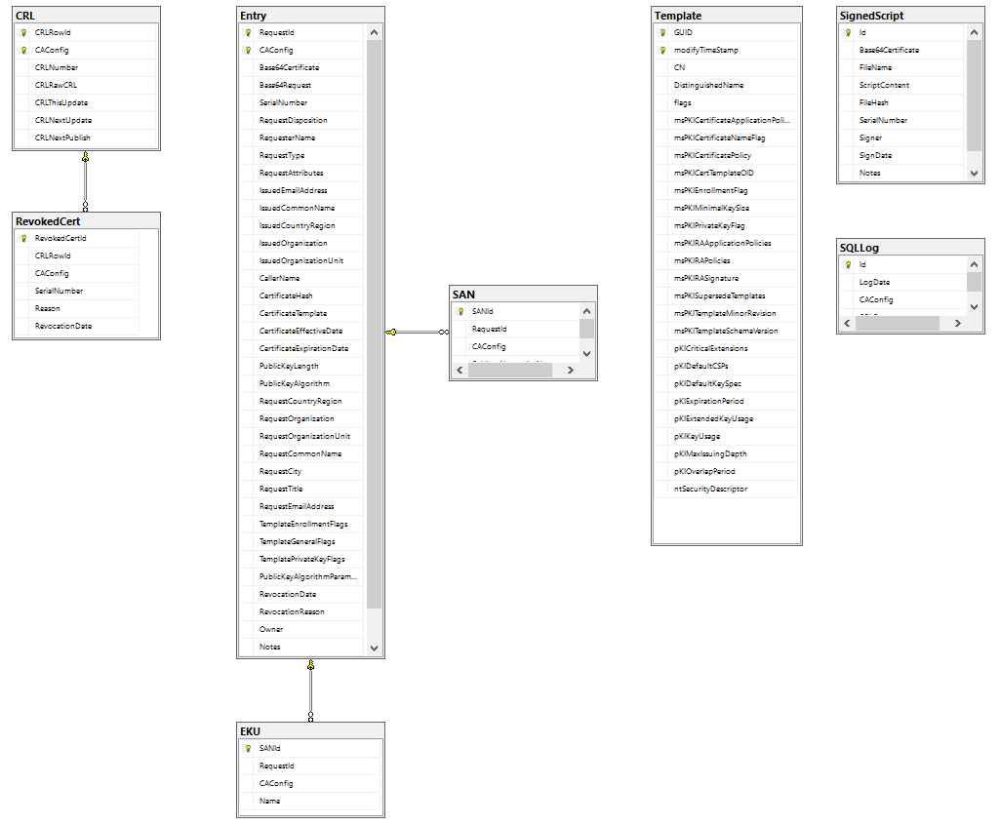

